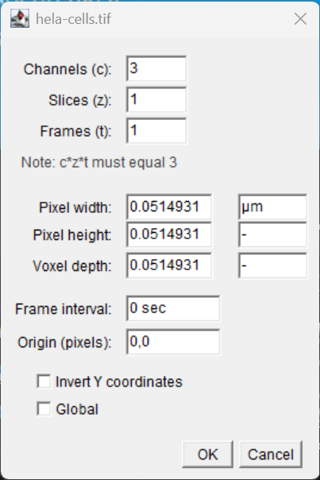

:::::::::::::::::::::::::::::::::::::: questions

- How are digital images represented inside a computer?
- What information is stored alongside an image?
- Why is image metadata important?
- Why does image calibration matter for quantitative measurements?

::::::::::::::::::::::::::::::::::::::::::::::::

::::::::::::::::::::::::::::::::::::: objectives

- Describe an image as a collection of pixels.
- Identify common image dimensions and image types.
- Inspect image metadata in Fiji.
- Explain the importance of spatial calibration.
- Distinguish between pixel measurements and real-world measurements.

::::::::::::::::::::::::::::::::::::::::::::::::

## Introduction

Before we can analyse biological images, we must understand what an image
actually is.

Although images appear to us as visual representations of biological samples,
computers do not "see" cells, nuclei, bacteria, or tissues.

Instead, computers store images as collections of numerical values.

In this episode we will explore how images are represented and how Fiji can be
used to inspect image information and metadata.

## Opening an Image

Start Fiji and open one of the built-in sample images.

Select:  `File → Open Samples → HeLa Cells`

{alt="three channel fluorescence micrograph of 4 HeLa Cells."}

The image should appear in a new image window.

Take a moment to inspect the image.

What biological structures can you identify?

Although we immediately recognise cells and nuclei, the computer only sees a
collection of numbers arranged in a grid.

## Images Are Made Of Pixels

Digital images consist of small elements called **pixels**.

Pixel is short for:  `Picture Element`

Each pixel stores a numerical value.

For grayscale images:

- low values appear dark
- high values appear bright

Together, large numbers of pixels create the images we recognise.

Zoom into the image using:  `View → Zoom → In`

or the magnifying glass tool. (or use the `+` and `-` keys.)

At high magnification the individual pixels become visible.

{alt="magnified image showing individual pixels"}

::::::::::::::::::::::::::::::::::::: challenge

Zoom into the image until individual pixels can be seen.

What shape are the pixels?

:::::::::::::::::::::::: solution

Pixels are arranged in a grid and appear as square elements. 

But - [pixels are not little squares](https://alvyray.com/Memos/CG/Microsoft/6_pixel.pdf).

Each pixel is a dimensionless sample stored as a numerical intensity value.

:::::::::::::::::::::::::::::::::

::::::::::::::::::::::::::::::::::::::::::::::::

## Image Dimensions

Biological images frequently contain more information than a simple
two-dimensional picture.

An image may include:

- Width (X)
- Height (Y)
- Channels (C)
- Depth (Z)
- Time (T)
- Well number

Modern microscopy experiments often generate multidimensional datasets.

## Exploring Image Properties

With the sample image open, select:  `Image → Properties`


A dialog box appears containing information about the image.

{alt="Fiji's Image Info Window"}

This information includes:

- image dimensions
- pixel size
- units
- number of slices
- number of frames

Collectively, this information forms part of the image metadata.

Fiji stores information describing the image
alongside the pixel data, if the image has the metadata embedded.

## Adding Calibration Information

Not all images contain calibration information.

For example:

- metadata may have been lost during file conversion
- images may have been exported incorrectly
- image files may have been cropped or modified outside Fiji

When calibration information is missing, Fiji reports measurements in pixels.

In some cases, the correct pixel size is known from the microscope settings or acquisition software.

### Manually Setting Calibration

Suppose we know that:

```text
1 pixel = 0.325 µm
```

To add this calibration information:

1. Select:

   ```text
   Image → Properties...
   ```

2. Enter:

   ```text
   Pixel Width:  0.325
   Pixel Height: 0.325
   Unit of Length: µm
   ```

3. Click **OK**.

The image is now calibrated.

Subsequent measurements will be reported in micrometres (µm) and square micrometres (µm²) rather than pixels.

::::::::::::::::::::::::::::::::::::: challenge

Open an image and inspect its properties:

```text
Image → Properties...
```

Does the image contain calibration information?

If not, assign a pixel size of:

```text
0.5 µm/pixel
```

and verify that the image dimensions update accordingly.

:::::::::::::::::::::::: solution

After entering the pixel size and units, Fiji updates the image properties.

Measurements are now reported using calibrated units rather than pixels.

:::::::::::::::::::::::::::::::::

::::::::::::::::::::::::::::::::::::::::::::::::

## Calibrating Using a Stage Micrometer

Sometimes the pixel size is unknown, but an image of a stage micrometer is available.

A stage micrometer is a microscope slide containing accurately spaced markings of known length.

To calibrate an image using a stage micrometer:

1. Open the stage micrometer image.
2. Select the **Straight Line** tool.
3. Draw a line spanning a known distance on the micrometer.

e.g.

```text
100 µm
```

4. Select:     `Analyze → Set Scale...`

5. Fiji will automatically record the measured distance in pixels.

6. Enter:

   ```text
   Known Distance: 100
   Unit of Length: µm
   ```

7. Click **OK**.

Fiji will calculate the pixel size and store the calibration information.

The image can now be measured using physical units.


::::::::::::::::::::::::::::::::::::: callout

## Adding a Scale Bar

Once an image has been calibrated, Fiji can add an accurate scale bar.

To add a scale bar:

1. Select:     `Analyze → Tools → Scale Bar...`

2. Configure the scale bar settings:

   - Width of the scale bar
   - Height (thickness)
   - Font size
   - Colour
   - Location within the image

3. Click **OK**.

A scale bar will be added to the image.

Scale bars are useful for:

- presentations
- posters
- publications
- communicating image scale to readers

### A Word of Caution

Adding a scale bar permanently modifies the displayed image.

For quantitative analysis, it is generally best practice to:

1. Perform all measurements on the original image.
2. Add scale bars only to copies intended for presentation or publication.

The scale bar is only correct if the image is properly calibrated. 
Always verify calibration before adding a scale bar.

::::::::::::::::::::::::::::::::::::::::::::::::


## Discussion

Modern microscope acquisition software typically records calibration information automatically and stores it as image metadata.

However, calibration information can sometimes be lost when images are:

- exported to different file formats
- processed using other software
- cropped or modified
- shared without their accompanying metadata

For this reason, it is good practice to check calibration before beginning any quantitative analysis.

When measurements appear unexpectedly large or small, calibration should be one of the first things to verify.


## What Is Metadata?

Metadata is often described as:

> Data about data or Data that describes data

For microscopy images, metadata may include:

- pixel size
- microscope settings
- objective lens
- channel names
- acquisition date
- exposure information
- dimensional information

Without metadata, it can be difficult or impossible to interpret image
measurements correctly.

## Why Calibration Matters

Suppose two nuclei each occupy:

```text
1000 pixels
```

Are they the same size?

Not necessarily.

The answer depends on the size represented by each pixel.

Measurements reported in pixels are often difficult to interpret biologically, 
unless comparisons are made.

Calibration allows measurements to be expressed in meaningful units such as:

- micrometres (µm)
- square micrometres (µm²)
- millimetres (mm)


## Bit Depth

Pixel values are stored using a specific ranges of values that are computer friendly. 
These ranges are called  the image "bit-depth". They are dictated by the detector that
was used to acquire the image.

Common bit depths include:

| Bit Depth | Possible Values | Type
| ---------- | ---------- | -------- |
| 8-bit | 0 to 255 | Positive Integer
| 16-bit | 0 to 65,535 | Positive Integer
| 32-bit | Large numerical range | Floating Point (Fractions!)

Higher bit depths allow finer graduations between intensity measurements. 
32-bit floating point data can store non-integer and negative values.

In fluorescence microscopy, 16-bit images are commonly used.

To view image information, select:  `Image → Show Info`

{alt="Fiji's Image Info Window"}

## Why Metadata Must Be Preserved

Many image-analysis problems begin when image data are exported incorrectly.

For example:

- calibration may be lost
- channel information may disappear
- bit-depth may be changed
- dimensional information may be removed

When image information is lost, quantitative measurements become unreliable.

Good scientific practice includes preserving both:

- image data
- metadata

throughout an analysis workflow.

::::::::::::::::::::::::::::::::::::: callout

## Images Are **NOT** Pictures - they are numerical datasets!

A microscopy image contains two equally important components:

1. Pixel data
2. Metadata

Removing the metadata is similar to removing labels from measurements in a
spreadsheet.

The numbers remain, but their meaning may be lost.

::::::::::::::::::::::::::::::::::::::::::::::::

## Looking Ahead

Now that we understand how images are represented inside a computer, we can
begin making quantitative measurements.

In the next episode we will learn how to:

- create regions of interest (ROIs)
- measure biological structures
- record quantitative measurements using Fiji

## Key Points

::::::::::::::::::::::::::::::::::::: keypoints

- Digital images are collections of pixels.
- Each pixel stores a numerical intensity value.
- Biological images may contain multiple dimensions, including channels, z-slices and timepoints.
- Metadata describes how an image was acquired and interpreted.
- Calibration is required to convert pixel measurements into biological units.
- Bit depth influences the range of intensity values that can be recorded.
- Quantitative image analysis depends on preserving both image data and metadata.

::::::::::::::::::::::::::::::::::::::::::::::::
