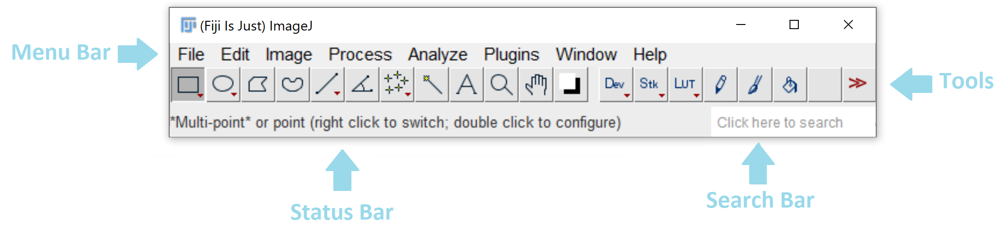
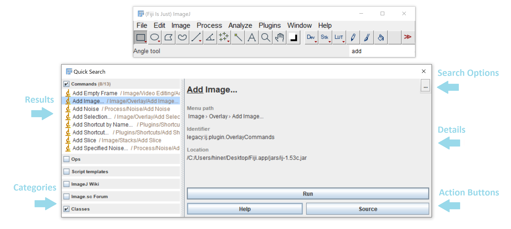
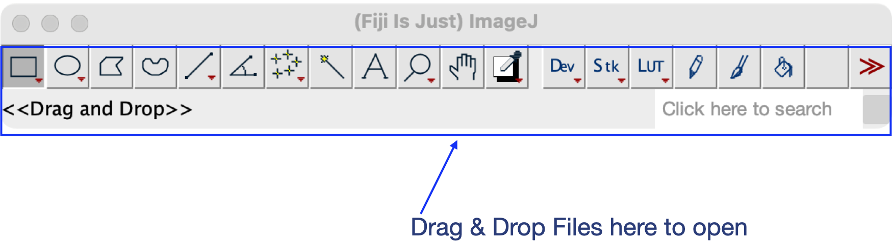
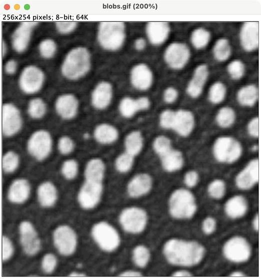
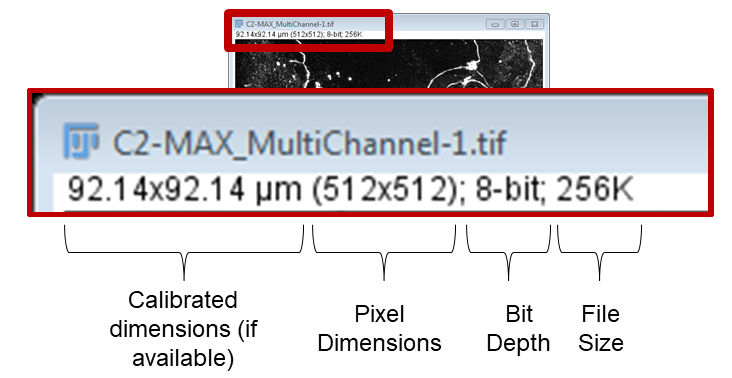
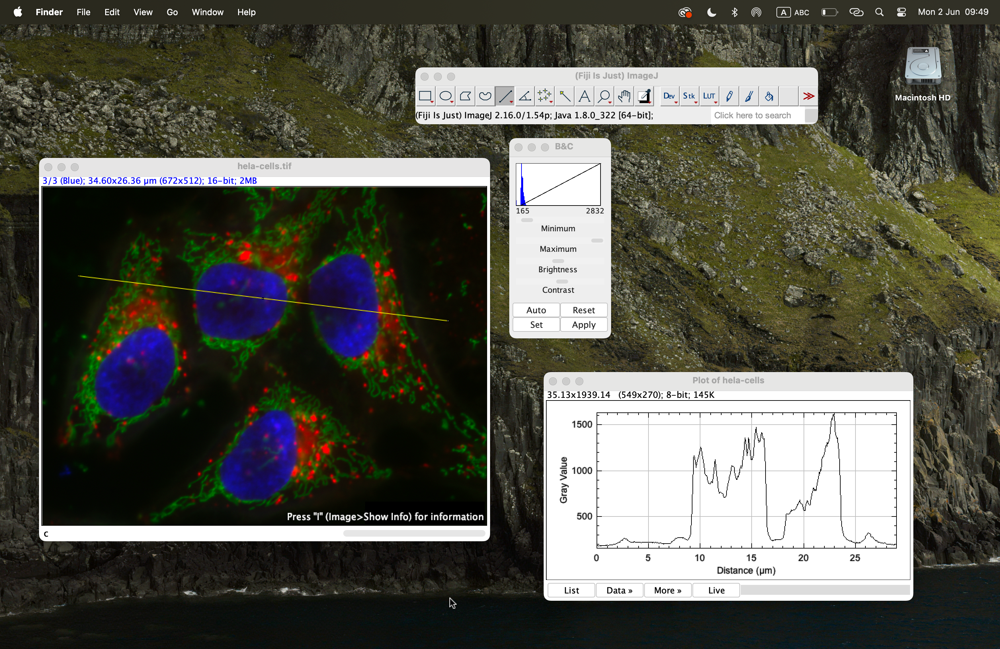
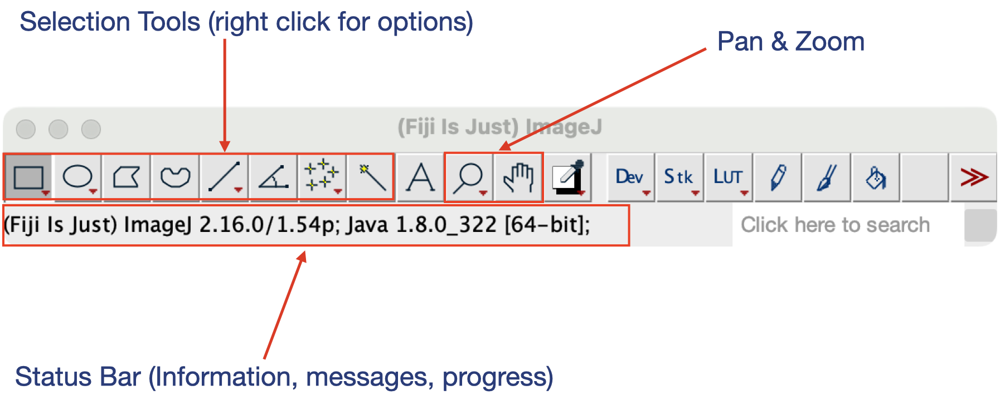

::::::::::::::::::::::::::::::::::::: objectives

- Recognise Fiji's main window and its constituent components.
- Navigate Fiji's menu structure.
- Open images using several different methods.
- Use the Fiji search bar to locate commands.
- Identify common tools in the Fiji toolbar.

::::::::::::::::::::::::::::::::::::::::::::::::

:::::::::::::::::::::::::::::::::::::: questions

- How do I get started with Fiji?
- Where can I find tools to manipulate images?
- How can I quickly locate commands?
- How can I open images in Fiji?

::::::::::::::::::::::::::::::::::::::::::::::::

## The Main Window

After starting Fiji, you will see the main Fiji window.

{alt="Fiji main window"}


The main window consists of several important components:

- The menu bar
- The toolbar
- The status bar
- The search bar

These components provide access to most of Fiji's functionality.

## The Search Bar

One of the most useful features in Fiji is the search bar.

The search bar allows you to:

- locate commands
- launch tools
- search documentation
- find plugins

The search bar can be activated either by clicking inside it or by using the keyboard shortcut:

```text
Ctrl + L     (Windows/Linux)
⌘ + L        (macOS)
```

{alt="Fiji search Function"}

As you type, Fiji displays matching commands and tools.

::::::::::::::::::::::::::::::::::::: callout

## Don't Memorise Menus

Experienced Fiji users rarely remember the location of every command.

Instead, they use the search bar to quickly find tools and documentation.

Whenever you cannot remember where a command is located, try searching for it first.

::::::::::::::::::::::::::::::::::::::::::::::::

::::::::::::::::::::::::::::::::::::: challenge

Use the search bar to find the command: `Brightness/Contrast`

Can you identify which menu contains this command?

:::::::::::::::::::::::: solution

The command is located under:

```text
Image → Adjust → Brightness/Contrast
```

The search bar provides a fast way to find commands without navigating through multiple menus.

:::::::::::::::::::::::::::::::::

::::::::::::::::::::::::::::::::::::::::::::::::

## The Menu Bar

The menu bar provides access to most of Fiji's functionality.

On macOS, the menu bar appears at the top of the screen rather than within the Fiji window.

The menus have different purposes, in general:

| Menu | Purpose |
|--------|--------|
| File | File input/output and creating new files |
| Edit | Selection and ROI handling |
| Image | Image visualisation and image information |
| Process | Image processing and filtering |
| Analyze | Measurements and statistics |
| Plugins | Plugins, macros, and utilities |
| Window | Window management |
| Help | Updates, documentation, and help resources |

As we progress through this lesson, we will use commands from several of these menus.

## Opening Images

There are several ways to open images in Fiji.

### Using the File Menu

Select:

```text
File → Open
```

and navigate to an image on your computer.

### Opening Sample Images

Fiji includes a variety of sample datasets that are useful for learning and experimentation.

Select:

```text
File → Open Samples
```

and choose an image from the list.

Throughout this workshop we will often use sample images to explore image-analysis concepts.

## Drag and Drop

You can also drag image files directly from your file manager onto the Fiji main window.

Fiji will automatically open the image.

{alt="Drag and Drop"}

Drag-and-drop is often the quickest way to open image files during routine analysis.


## The Image Window

Whenever you open an image, whether via: `File → Open`, drag-and-drop, or: `File → Open Samples`

Fiji opens the image in its own image window.

{alt="blobs"}

The image window has the filename as its title and displays useful information above the image.

Depending on the image, this information may include:

- The image dimensions in real-world units (if calibration information is available)
- The image dimensions in pixels
- The image type and bit depth
- The amount of memory required to store the image

For example:

{alt="Fiji image window showing image information"}

In this example:

- The image is calibrated, so the physical dimensions are displayed as: `  92.14 × 92.14 µm`

- The image consists of: `512 × 512 pixels`

- The image type is: `8-bit grayscale`

- The image occupies approximately: `256K`  of memory.

As we learned in the previous episode, 
calibration information allows pixel-based measurements to be converted into biologically meaningful units.

::: challenge

Open one of Fiji's sample images.

Can you identify:

1. The image dimensions in pixels?
2. The image type?
3. Whether calibration information is available?

::: solution

The exact answers depend on the image selected.

However, the information displayed above the image window should include:

- Pixel dimensions
- Image type
- Physical dimensions if calibration information is present

:::

:::

### Multiple Windows

Unlike many image-analysis applications, Fiji does not restrict images and results to a single workspace.

Each image, plot, results table, or dialog is displayed in its own independent window.

This means that multiple windows can be open simultaneously.

{alt="Screenshot showing multiple Fiji windows"}

During an analysis session you may have several different types of windows open at the same time, including:

- Images
- Results tables
- ROI Manager windows
- Histograms
- Plots
- Dialog boxes

As analyses become more complex, learning to manage multiple windows efficiently becomes increasingly important.

::::::::::::::::::::::::::::::::::::: callout

## Images Have Properties

The information displayed in the image window provides a quick summary of important image properties.

Before beginning any analysis, it is worth checking:

- the image dimensions
- the image type
- whether the image is calibrated

These properties can influence which analysis methods are appropriate and how measurements should be interpreted.

:::::::::::::::::::::::::::::::::::::::::::::::

## The Toolbar

The toolbar contains many of Fiji's most commonly used tools.

These include:

- Rectangle selection
- Oval selection
- Polygon selection
- Freehand selection
- Straight line selection
- Zoom tool
- Hand tool
- Point tool

To activate a tool, simply click its icon.

Some tools provide additional options that can be accessed by double-clicking the icon.

Many toolbar buttons contain additional tools.

If a small red triangle appears in the lower-right corner of an icon, right-click the icon to reveal alternative tools.

For example, the rectangle tool also provides:

- Rectangle
- Rounded Rectangle
- Rotated Rectangle

{alt="Fiji's tools"}

## The Status Bar

The status bar is located at the bottom of the Fiji window.

The information displayed changes depending on what Fiji is doing.

At different times, the status bar may display:

- tool hints
- image information
- processing status
- progress bars

During long-running operations, the search bar area is temporarily replaced by a progress bar.

The status bar can provide useful feedback when running image-processing operations.

::: challenge

Open one of Fiji's sample images and answer the following questions:

1. Which tool is currently active?
2. Can you find an alternative tool hidden beneath one of the toolbar icons?
3. What information is displayed in the status bar when you move your mouse over the image?

::: solution

Learners should discover that:

- tools can be activated by clicking toolbar icons
- some toolbar buttons contain multiple tools
- the status bar provides useful information about the image and current tool

:::

:::

## Discussion

New users are often tempted to memorise the location of every menu item and command.

In practice, experienced users rely heavily on:

- the search bar
- toolbar icons
- keyboard shortcuts

As workflows become more complex, knowing how to quickly locate commands becomes 
more valuable than memorising menu locations.

The goal at this stage is not to master every tool in Fiji, 
but to become comfortable navigating the interface.

## Looking Ahead

Now that we can navigate Fiji and open images, 
we are ready to begin making quantitative measurements.

In the next episode, we will learn how to:

- create regions of interest (ROIs)
- configure measurement settings
- measure biological structures
- record results for analysis

## Key Points

::::::::::::::::::::::::::::::::::::: keypoints

- Fiji's main window consists of the menu bar, toolbar, status bar, and search bar.
- The search bar is often the fastest way to locate commands and tools.
- Fiji images can be opened using the File menu, sample datasets, or drag-and-drop.
- The toolbar contains selection, navigation, and measurement tools.
- Many toolbar icons provide access to additional tools.
- The status bar provides feedback about tools, images, and processing operations.
- Becoming comfortable navigating Fiji is an important first step toward building image-analysis workflows.

::::::::::::::::::::::::::::::::::::::::::::::::
