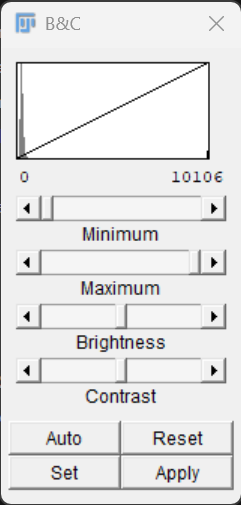

::::::::::::::::::::::::::::::::::::: objectives

- Distinguish between image data and image display.
- Explain the purpose of lookup tables (LUTs).
- Describe how fluorescence channels are represented in digital images.
- Use the Channels Tool to explore multichannel images.
- Split multichannel images into individual channels.
- Adjust image display settings without altering image data.

::::::::::::::::::::::::::::::::::::::::::::::::

:::::::::::::::::::::::::::::::::::::: questions

- Are microscopy images really coloured?
- What is a lookup table (LUT)?
- What is the difference between a channel and a colour?
- How can multichannel images be explored in Fiji?
- Does adjusting brightness and contrast change the image data?

::::::::::::::::::::::::::::::::::::::::::::::::

## Introduction

When we look at microscopy images, we often see bright colours.

Fluorescence microscopy images frequently appear:

- blue
- green
- red
- magenta
- yellow

However, computers do not store images as colours in the way that we see them.

Instead, microscopy images are usually stored as collections of numerical intensity values.

In this episode, we will explore how image data are displayed in Fiji and 
learn the important distinction between **image data** and **image display**.

## Grayscale Images

Open the sample image:

```text
File → Open Samples → M51 Galaxy (16-bits)
```

The image should appear as a grayscale image.

In a grayscale image, by convention:

- dark pixels have low intensity values
- bright pixels have high intensity values

The image consists entirely of numerical values arranged into a matrix.

::::::::::::::::::::::::::::::::::::: challenge

```text
File → Save As ... → Text File...
```
and save the file `m51.csv` somewhere you can find it.

Open the file in a text editor or spreadsheet program. What do you see?

:::::::::::::::::::::::: solution

You should see an array of numbers. This reinforces the notion that images are 
numbers!

The image itself contains only intensity values.

:::::::::::::::::::::::::::::::::

::::::::::::::::::::::::::::::::::::::::::::::::


::::::::::::::::::::::::::::::::::::: challenge

Open any sample image and zoom in ( use the `+` & `-` keys to zoom in and out.)

Can you identify regions of high intensity and regions of low intensity?

Which parts of the image appear brightest?

:::::::::::::::::::::::: solution

The brightest regions correspond to pixels with the highest intensity values.

The darkest regions correspond to pixels with the lowest intensity values.

Fiji displays these intensity values using shades of grey.

:::::::::::::::::::::::::::::::::

::::::::::::::::::::::::::::::::::::::::::::::::

## Image Histograms

A useful way to visualise image intensity values is with a histogram.

A histogram shows:

- which intensity values are present in an image
- how frequently those values occur
- the overall distribution of pixel intensities

Open the Cell Colony image and select:

```text
Analyze → Histogram
```

A new histogram window will appear.

The horizontal axis represents pixel intensity values.

The vertical axis represents the number of pixels with a particular intensity value.

For an 8-bit image:

```text
0 -------------------- 255
```

corresponds to:

```text
Black ---------------- White
```

pixels.

The histogram provides a summary of all pixel values within the image.

## Understanding Histograms

Suppose an image contains mostly dark pixels and only a few bright structures.

Its histogram might look something like:

```text
Pixels
  |
  |████████████████████
  |████████
  |███
  |
  +------------------------
     0              255
```

In this example:

- most pixels have low intensity values
- relatively few pixels have high intensity values

A brighter image would typically have a histogram shifted towards higher intensity values.

Histograms allow us to examine image data quantitatively rather than relying solely on visual appearance.

::::::::::::::::::::::::::::::::::::: challenge

Open the histogram for the Cell Colony image.

Where do most of the pixel intensities occur?

Are the majority of pixels dark, bright, or somewhere in between?

:::::::::::::::::::::::: solution

Most microscopy images contain large areas of background.

As a result, many pixels often have relatively low intensity values, producing a peak on the left-hand side of the histogram.

The precise shape of the histogram depends on the image content.

:::::::::::::::::::::::::::::::::

::::::::::::::::::::::::::::::::::::::::::::::::

## Histograms and Image Appearance

Two images may appear very different while containing similar intensity distributions.

Conversely, images that appear similar may have very different histograms.

Histograms provide an objective description of image intensity values that is independent of our visual perception.

For this reason, histograms are frequently used when evaluating image quality.

## Histograms and Brightness & Contrast

Open:

```text
Image → Adjust → Brightness/Contrast
```

Notice that the Brightness & Contrast window contains a histogram.

This histogram displays the same intensity distribution seen in the Histogram window.

Move the minimum and maximum sliders.

Observe that:

- the image appearance changes
- the display range changes
- the histogram itself remains unchanged

This occurs because brightness and contrast adjustments affect image display rather than the underlying pixel values.

::::::::::::::::::::::::::::::::::::: challenge

Adjust the brightness and contrast of the image.

What happens to the appearance of the image?

What happens to the histogram?

:::::::::::::::::::::::: solution

The image may appear brighter, darker, or more contrasty.

However, the underlying pixel values remain unchanged.

As a result, the histogram remains unchanged.

:::::::::::::::::::::::::::::::::

::::::::::::::::::::::::::::::::::::::::::::::::

::::::::::::::::::::::::::::::::::::: callout

## Histograms Describe the Data

A histogram is a summary of the pixel intensity values present in an image.

Unlike image display settings, the histogram reflects the underlying image data.

Histograms are useful for understanding image content, evaluating image quality, and comparing images objectively.

::::::::::::::::::::::::::::::::::::::::::::::::

## What Is A LUT?

A **Lookup Table (LUT)** controls how pixel values are displayed.

A LUT maps numerical intensity values to display colours.

It is actually a table that translates image data values into display brightness.
E.g.

| Image Pixel Value | Display Brightness |
|:-----------:|:-----------|
|0|0|
|1|1|
|...|...|
|254|254|
|255|255|

This LUT linearly maps the range of values in an 8-bit image to the brightness 
values on an 8-bit display. Fiji maps the 16-bit range (0 to 65535) to the same
brightness values on the screen - the screen cannot change to 16-bit.


| Image Pixel Value | Display Brightness |
|:-----------:|:-----------|
|0 -254|0|
|255-511|1|
|...|...|
|65,024-65,279|254|
|65,280-65,536|255|


Open the menu:

```text
Image → Lookup Tables
```
Selecting one of the LUTs applies it to the currently active image.

Try several different LUTs:

- Fire
- Ice
- Green
- Magenta

Observe how the appearance of the image changes.

After experimenting, return the image to:

```text
Image → Lookup Tables → Grays
```

::::::::::::::::::::::::::::::::::::: challenge

Apply several different LUTs to the same image.

What happens to the image appearance?

Have the image data changed?

:::::::::::::::::::::::: solution

The appearance of the image changes because intensity values are displayed using different colours.

The image data remain unchanged.

Only the visual representation has changed.

:::::::::::::::::::::::::::::::::

::::::::::::::::::::::::::::::::::::::::::::::::

::::::::::::::::::::::::::::::::::::: callout

## LUTs Change Display, Not Data

Changing a LUT affects how an image is displayed.

It does **not** modify the underlying pixel values.

The same image data can be displayed using many different LUTs.

::::::::::::::::::::::::::::::::::::::::::::::::

## Fluorescence Images

Many microscopy experiments use fluorescent labels to visualise biological structures.

Examples include:

| Label | Common Target | Common Display Colour |
| ------- | ------- | ------- |
| DAPI | DNA/Nuclei | Blue |
| GFP | Protein of Interest | Green |
| mCherry | Protein or Reporter | Red |

When displayed together, these labels produce colourful images.

However, each fluorescence channel is acquired as an independent grayscale image.

The colours are assigned later for visualisation.

## Channels Are Not Colours

A common misconception is that:

```text
DAPI = blue
GFP = green
mCherry = red
```

In reality:

- DAPI is a channel
- GFP is a channel
- mCherry is a channel

The blue, green, and red colours are display choices.

A GFP channel could just as easily be displayed:

- green
- magenta
- yellow
- grayscale

The display colour does not affect the underlying data.

::::::::::::::::::::::::::::::::::::: challenge

Why might it be useful to display the same channel using different colours?

:::::::::::::::::::::::: solution

Different colours may make structures easier to visualise or distinguish 
when multiple channels are displayed together.

Changing display colours does not alter the data.

:::::::::::::::::::::::::::::::::

::::::::::::::::::::::::::::::::::::::::::::::::

## Working With Multichannel Images

Open the sample image:

```text
File → Open Samples → HeLa Cells
```

This image contains multiple fluorescence channels.

Each channel contains different information about the sample.

The image is displayed as a composite image, 
where several channels are shown simultaneously. But each channel is made of 16-bit numerical data. 
There is no colour information as part of the image data.

## Exploring Channels

To inspect channels individually, open:

```text
Image → Color → Channels Tool...
```

The Channels Tool allows you to:

- enable and disable channels
- change display colours
- switch between grayscale and colour display
- explore channels independently

Try turning channels on and off.

Notice how different structures appear in different channels.

::::::::::::::::::::::::::::::::::::: challenge

Use the Channels Tool to view each channel independently.

What structures become visible when only a single channel is displayed?

:::::::::::::::::::::::: solution

The answer depends on the image.

Each channel highlights different biological structures and therefore reveals different information about the sample.

:::::::::::::::::::::::::::::::::

::::::::::::::::::::::::::::::::::::::::::::::::

## Splitting Channels

Sometimes it is useful to separate a multichannel image into individual images.

Select:

```text
Image → Color → Split Channels
```

Fiji creates a separate image window for each channel.

Each image represents a single channel from the original dataset.

Notice that the resulting images are displayed independently and can be analysed separately.

This is often useful when measurements need to be made from a specific fluorescence channel.

::::::::::::::::::::::::::::::::::::: challenge

Split the channels of the HeLa Cells image.

How many channels are present?

How many image windows are created?

:::::::::::::::::::::::: solution

The number of windows corresponds to the number of channels in the original image.

Each window contains the intensity values from one channel. The HeLa cells image has 3 channels.

:::::::::::::::::::::::::::::::::

::::::::::::::::::::::::::::::::::::::::::::::::

## Brightness and Contrast

Sometimes images appear too dark or too bright for comfortable viewing.

Open:

```text
Image → Adjust → Brightness/Contrast
```
{alt="brightness and contrast"}

The Brightness & Contrast window appears (floating) and allows the display range to be adjusted.

Move the sliders and observe what happens.

You should notice that the visibility of structures changes dramatically.

However, the pixel values remain unchanged. Notice that the line in the graph moves.

::::::::::::::::::::::::::::::::::::: challenge

Adjust the brightness and contrast until the image looks very different.

Have the underlying pixel values changed?

:::::::::::::::::::::::: solution

No.

The image display has changed, but the underlying intensity values remain the same.

Brightness and contrast adjustments affect visualisation rather than measurement.

:::::::::::::::::::::::::::::::::

::::::::::::::::::::::::::::::::::::::::::::::::

::::::::::::::::::::::::::::::::::::: callout

## Be Careful With "Apply"

The Brightness & Contrast window contains an **Apply** button.

Adjusting the sliders changes only the display.

Pressing **Apply** permanently modifies the pixel values in the image.

Before using **Apply**, make sure you understand that you are changing the underlying image data.

::::::::::::::::::::::::::::::::::::::::::::::::

## Discussion

The distinction between image display and image data is fundamental to quantitative image analysis.

The same image may be displayed:

- in grayscale
- using a pseudocolour LUT
- as a multichannel composite image

Yet the underlying measurements remain identical.

Understanding this distinction helps avoid common mistakes when interpreting microscopy images.

## Looking Ahead

Now that we understand how images are displayed, we are ready to begin making quantitative measurements.

In the next episode, we will learn how to:

- create regions of interest (ROIs)
- configure measurement settings
- measure biological structures
- record results in Fiji

## Key Points

::::::::::::::::::::::::::::::::::::: keypoints

- Microscopy images are stored as numerical intensity values.
- LUTs control image display but do not change image data.
- Fluorescence channels are usually acquired as independent grayscale images.
- Display colours are visualisation choices and can be changed.
- The Channels Tool can be used to explore multichannel images.
- Split Channels separates multichannel images into individual images.
- Brightness and contrast adjustments affect display, not measurements.
- Pressing **Apply** permanently modifies image data.

::::::::::::::::::::::::::::::::::::::::::::::::
